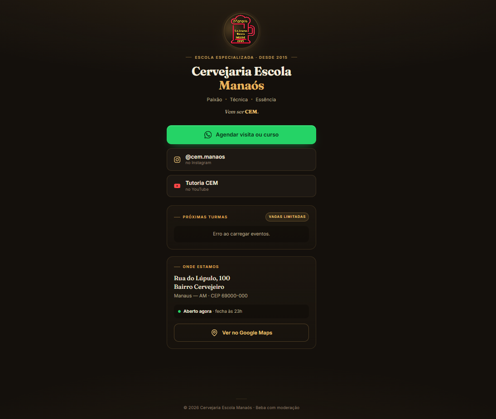
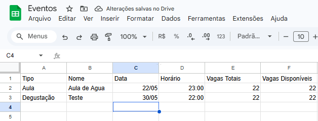
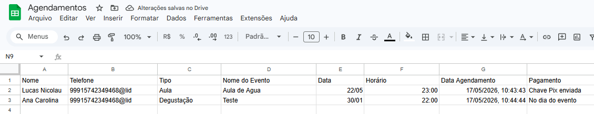
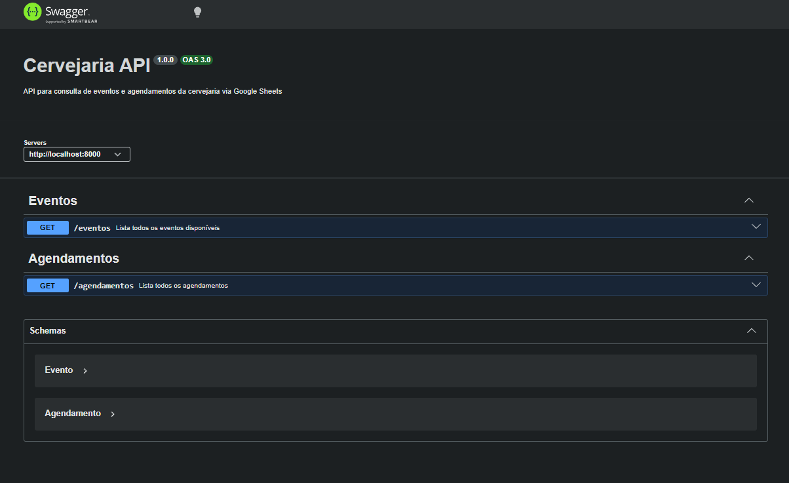

# 🍺 Cervejaria Cem — Scheduling Bot System


Full-stack web application developed to automate event scheduling for Cervejaria Cem, integrating a WhatsApp bot with Google Sheets as a database, supporting course and tasting reservations with Pix or on-day payment options.

🔗 **Live Demo:** coming soon

## 📸 Screenshots

Below are some views of the application, including the landing page and the Google Sheets database.

### 🍺 Landing Page



### 📊 Google Sheets





## 💡 Context

Managing event reservations manually via WhatsApp messages is time-consuming and error-prone, especially as the number of events and customers grows.

The idea came from the need to automate the **entire scheduling process** — from the first customer message to saving the booking in a spreadsheet — without requiring a dedicated database or complex infrastructure.

This project was created to handle the full reservation flow through WhatsApp, using **Google Sheets** as a lightweight and accessible database that the brewery owner can manage directly.

## 📁 Project Structure

```
cervejaria/
├─ src/
│  ├─ bot/
│  │  └─ bot.ts                 # WhatsApp bot logic and conversation flow
│  │
│  ├─ sheets/
│  │  ├─ sheetsClient.ts        # Google Sheets authentication and client setup
│  │  └─ sheetsService.ts       # Sheets read/write operations
│  │
│  ├─ frontend/
│  │  └─ main.ts                # Frontend TypeScript — events list and UI logic
│  │
│  ├─ index.ts                  # Express server entry point
│  └─ swagger.ts                # Swagger/OpenAPI documentation config
│
├─ public/
│  ├─ index.html                # Landing page
│  ├─ styles.css                # Frontend styles
│  ├─ main.js                   # Compiled frontend script
│  └─ img/
│     ├─ logo.png               # Brewery logo
│     └─ readme/                # README screenshots
│
├─ .env
├─ credentials.json             # Google Service Account key
├─ readme.MD                    # Project documentation
├─ tsconfig.json                # Backend TypeScript config
├─ tsconfig.frontend.json       # Frontend TypeScript config
└─ package.json
```

## ⚙️ How It Works

1. Customer sends **"quero agendar"** via WhatsApp
2. Bot asks whether they want to book a **course (Aula)** or **tasting (Degustação)**
3. Bot fetches available events from Google Sheets and lists them
4. Customer picks an event by number
5. Bot asks for the customer's **full name**
6. Bot asks for the preferred **payment method**: Pix or on the day of the event
7. If Pix: bot sends the Pix key and waits for the **payment receipt** (image or PDF)
8. Booking is saved to the Agendamentos sheet and the event's available slots are decremented
9. Customer receives a **confirmation message**

## 🤖 Bot Flow

### Conversation Steps

The bot manages each user's state independently using an in-memory `Map`, progressing through the following stages:

- `escolha_tipo` — customer chooses between Aula or Degustação
- `escolha_evento` — customer picks from available events fetched from Sheets
- `aguardando_nome` — customer provides their full name
- `aguardando_pagamento` — customer chooses payment method
- `aguardando_comprovante` — (Pix only) customer sends payment receipt

### Event Slot Management

After a booking is confirmed, the bot reads the current available slots from the **Eventos** sheet and writes back the decremented value, keeping the spreadsheet always up to date.

## 🗃️ Google Sheets Structure

The system uses two spreadsheets:

**Eventos sheet**
- tipo 
- nome 
- data 
- horario 
- vagas_total 
- vagas_disponiveis


**Agendamentos sheet**
- nome 
- telefone 
- tipo 
- nome_evento 
- data 
- horario 
- data_agendamento 
- pagamento

This design allows:

- real-time slot availability control
- full booking history accessible to the owner
- no dedicated database required

## 📡 API Documentation

Swagger documentation is available at: [Swagger](http://localhost:8000/docs)



## 🌐 Deployment

Production setup:

- Entry point: `dist/index.js` (compiled from `src/index.ts`)
- Frontend served as static files via `express.static`, with `index.html` as the index
- Bot initializes alongside the server via `whatsapp-web.js` with `LocalAuth` session persistence
- Environment variables configured via `.env`: `PORT`, `API_URL`, `EVENTOS_SHEET_ID`, `AGENDAMENTOS_SHEET_ID`, `PIX_KEY`

## 📖 References

- [Google Cloud](https://console.cloud.google.com/)
- [Google Workspace](https://developers.google.com/workspace/sheets?hl=pt-br)

## 👨‍💻 Author

**Lucas Nicolau** — Software Engineering Student at [@UFAM](https://www.ufam.edu.br).